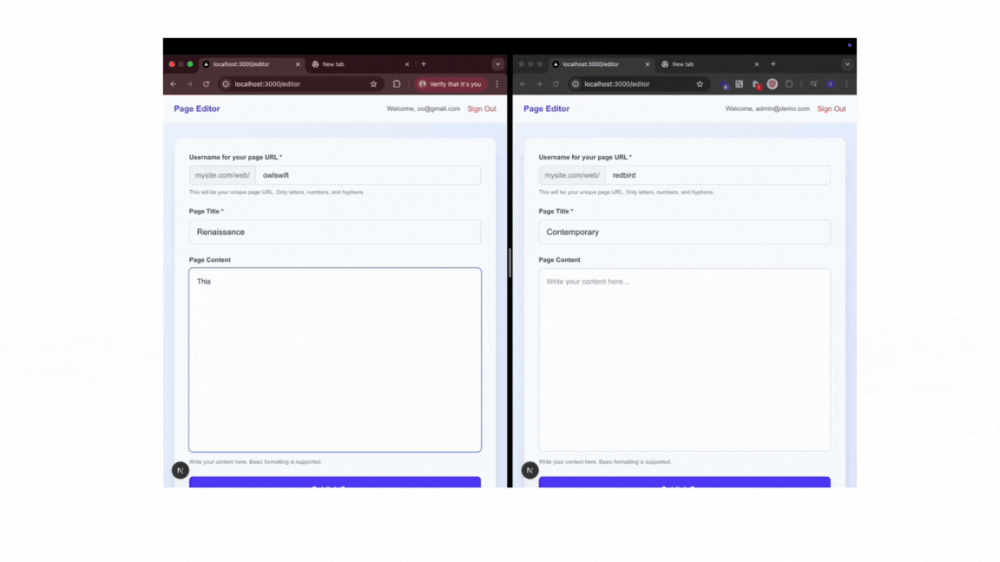

# Supabase + Next.js Page Builder (Test Project)

This is a minimal Next.js project that demonstrates:

- User authentication with **Supabase Auth** (email + password).
- An inline editor to add a **page title** and content.
- Saving the page into Supabase (Postgres).
- Serving public pages at `/web/{username}`.



---

## 🚀 Setup Instructions

### 1. Clone the repo
```bash
git clone <your-repo-url>
cd <your-repo-folder>
````

### 2. Install dependencies

```bash
npm install
# or
yarn install
```

### 3. Setup Supabase

1. Go to [Supabase](https://supabase.com/), create a new project.

2. Copy your project **URL** and **anon public key** from
   **Project Settings → API**.

3. In the Supabase **SQL Editor**, run:

```sql
-- Create pages table
create table pages (
  id uuid default gen_random_uuid() primary key,
  owner_id uuid not null references auth.users(id) on delete cascade,
  username text not null,
  title text,
  content text,
  published boolean default false,
  inserted_at timestamp with time zone default now(),
  updated_at timestamp with time zone default now(),
  constraint pages_username_unique unique (username)
);
```

4. Add Row Level Security (RLS) policies:

```sql
-- Enable RLS
alter table pages enable row level security;

-- Only the policies we actually need:
-- Users can create their own pages
create policy "Users can create pages" on pages
  for insert with check (auth.uid() = owner_id);

-- Anyone can view published pages
create policy "Anyone can view published pages" on pages
  for select using (published = true);

-- Create index for performance
create index pages_username_idx on pages (username);
```

### 4. Environment variables

Create a `.env.local` file in your project root:

```env
NEXT_PUBLIC_SUPABASE_URL=your-supabase-url
NEXT_PUBLIC_SUPABASE_ANON_KEY=your-supabase-anon-key
```

### 5. Run the project

```bash
npm run dev
```

Visit [http://localhost:3000](http://localhost:3000).

---

## 📂 Project Structure

```
/pages
  index.tsx          -> Sign in / Sign up
  editor.tsx         -> Inline editor for logged in users
  web/[username]     -> Public page display
/lib
  supabaseClient.ts -> Supabase client config
  types.ts          -> holds all interfaces used in the project
/services
  authService.ts    -> Auth helpers
  pageService.ts    -> Page helpers
/hooks
  useAuth.ts        -> Auth state management
  usePageEditor.ts  -> Editor state management
```

---

## ⚠️ Limitations

* **Minimal auth**: Only email + password auth, no social providers.
* **No validations**: Username uniqueness is enforced in DB, but no regex check in frontend.
* **Basic editor**: Uses a textarea — no rich-text or advanced formatting.
* **No image/media support**: Only text content stored in Supabase.
* **No custom domains**: Pages are accessible only via `/web/{username}`.

---

## ✅ Next Steps (if extended)

* Add **rich-text editor** (e.g., TipTap, Quill).
* Add **media uploads** (Supabase Storage + signed URLs).
* Add **custom domains / subdomains** support.
* Improve validation + error handling.

